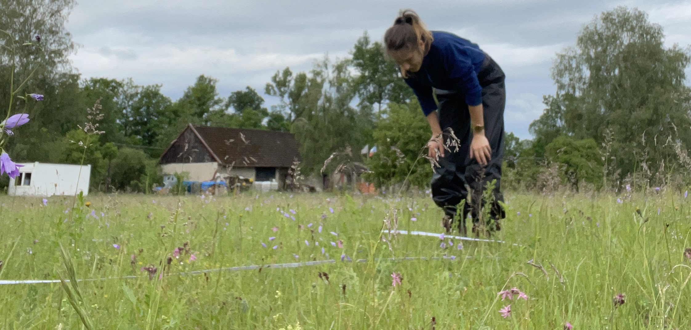
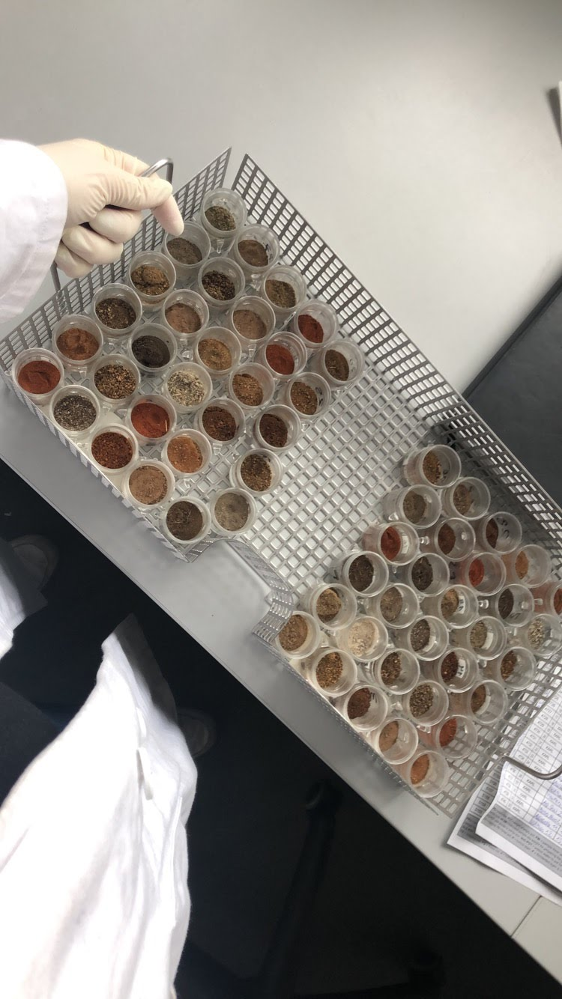
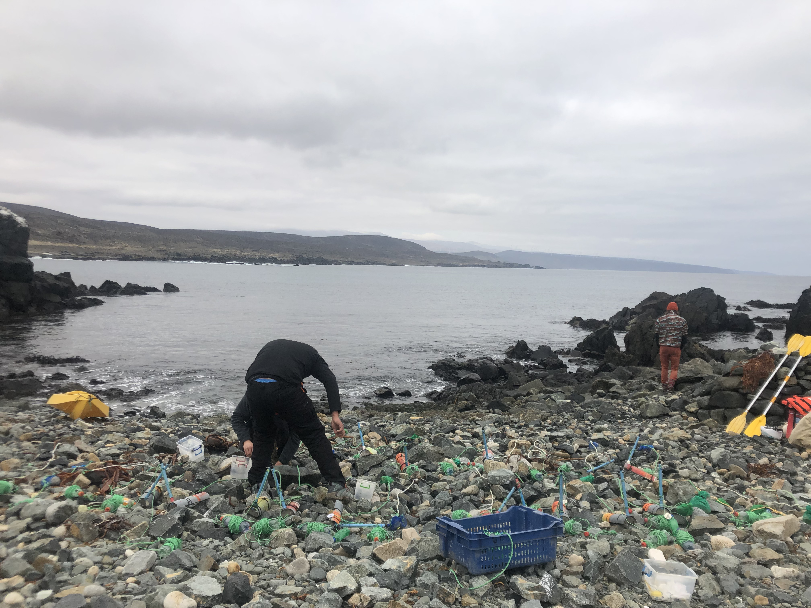
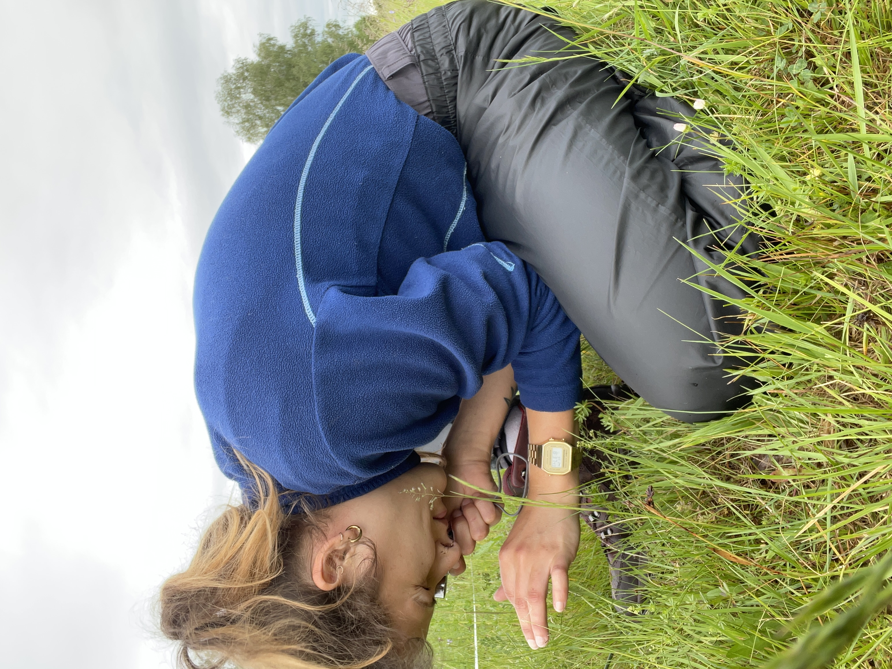

Hi, welcome! This is my personal website mostly about my science stuff. I'm Friederike Johanna Rosa but everyone calls me Frieda. 

As a biologist currently doing her doctoral studies in Prague, Czech Republic, I split my time between ecological modelling, learning Czech and - together with my partner - taking care of our houseplants and cats.

Growing up in a small German village near Bonn, I practically lived in the woods covered in mud catching tadpoles and grasshoppers where I've felt at home among the leaves and grasses since I can remember.

Following my high school graduation, I quickly moved to Leipzig, where I did my bachelor's and master's in biology, and biodiveristy, ecology and evolution respectively (2019, 2021). 
During my bachelor studies and student jobs (2016-2019), I mostly focussed on botany, genetics and plant biotechnological subjects, but through unplanned circumstances, I found my passion in exploring the bigger things in nature. In 2019 I finished my bachelor's thesis at iDiv, where I explored the secret drivers of soil microbes and their productivity across global drylands. The thesis was mostly focussed on laboratory work with soil samples, but also included spatial macroecological modelling. 

Right after I handed in my thesis, I headed to Coquimbo, Chile to do a DAAD-funded research intership on microplastics pollution in the South Pacific.

When I returned to Leipzig, I started a student job at iDiv in the Eisenhauer Lab to count and determine invertebrate samples from an experimental insect decline project and do fieldwork on the MyDiv BEF experimental site in Bad Lauchstädt. When COVID hit, I had to refocus my work to computational studies and started my master's thesis with Renske Onstein at iDiv on the macroecology & macroevolution of fruit size in plants (see New Phytologist paper from 2023 or State of the Worlds Plants & Fungi 2023 report, Chapter 4).

In September 2023 I started my 4-year funded doctoral studies at the Czech University of Life Sciences in Prague in Petr Keil's Modeling of Biodiversity Lab working on universal patterns of temporal biodiversity change. 

In 2024 I joined a [European Grassland project](https://www.adamclarktheecologist.com/research/grace) for which I will spend a couple of weeks in the field, sampling grassland plots along the Czech-Austrian border. The project is not related to my doctoral studies - I just really missed being outside in nature and applied for this job that was offered by my doctoral thesis supervisor.

