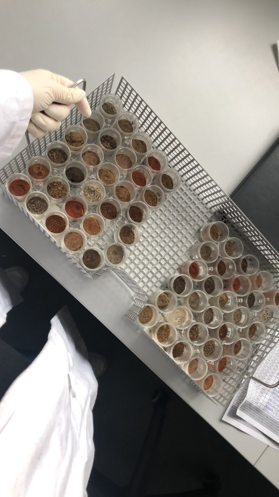
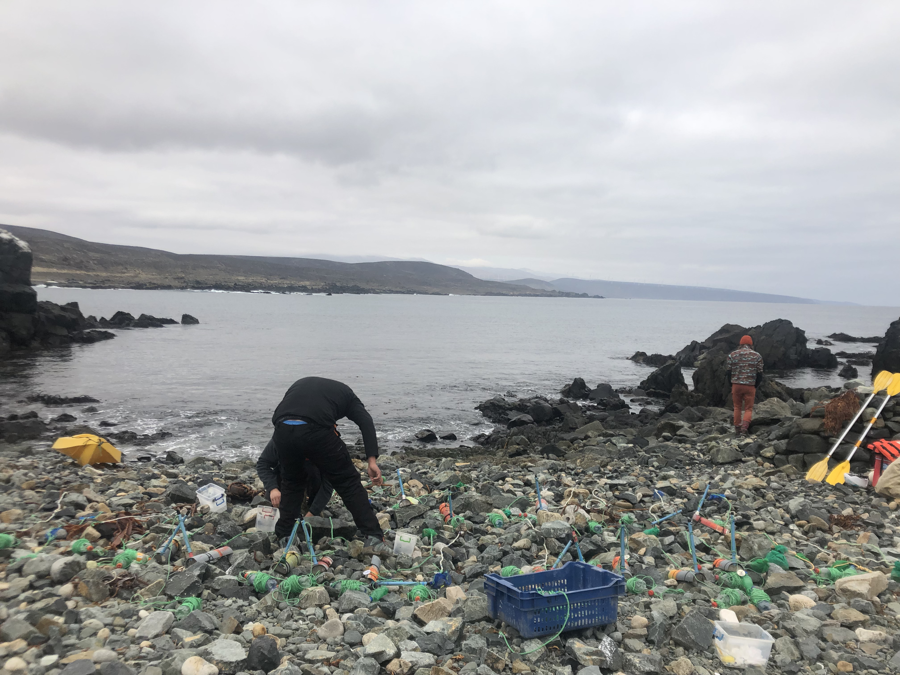
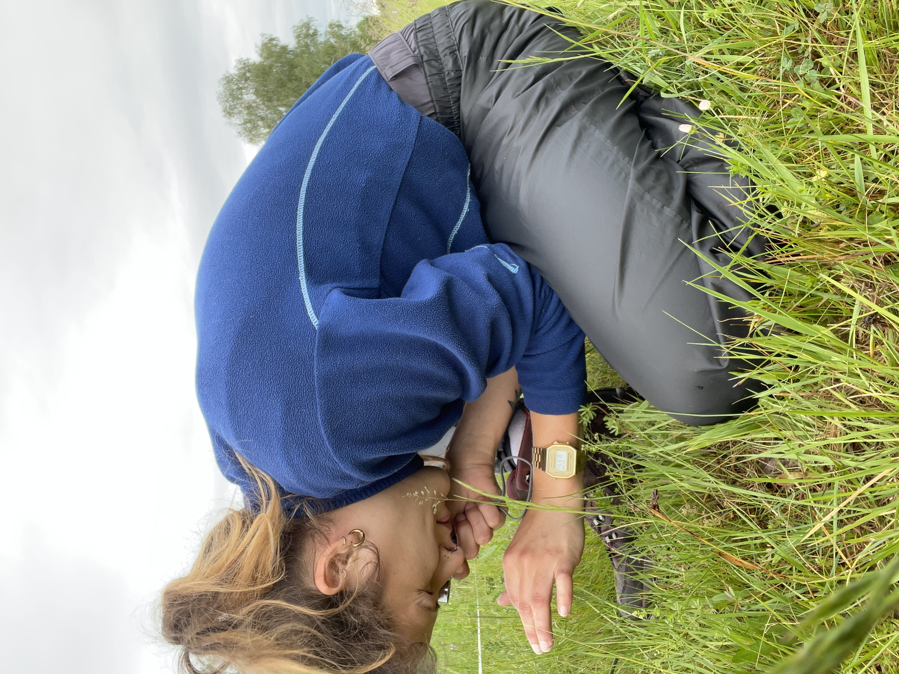

Intro 
=====
Hi, welcome! This is my personal website mostly about my science stuff. I'm Friederike but everyone calls me Frieda. 
I'm a biologist currently living in Prague, Czechia but moving to Sweden soon, where I'll start a new PhD in October on the _Evolution of Biomes on Madagascar_ at Stockholm University. 

Growing up in a small German village near Bonn, I practically lived in the woods covered in mud catching tadpoles and grasshoppers where I've felt at home among the leaves and grasses since I can remember.

Bachelor studies & activities
=====
Following my high school graduation, I quickly moved to Leipzig, where I did my bachelor's and master's in biology, and biodiveristy, ecology and evolution respectively (2019, 2021). 
During my bachelor studies and student jobs (2016-2019), I mostly focussed on botany, genetics and plant biotechnological subjects, but through unplanned circumstances, I found my passion in exploring the bigger things in nature. In 2019 I finished my bachelor's thesis at [iDiv](https://www.idiv.de/research/core-research-groups/experimental-interaction-ecology/), [where I explored the secret drivers of soil microbes and their productivity across global drylands](https://friedarosa.github.io/publications/bachelor). The thesis was mostly focussed on laboratory work with soil samples, but also included spatial macroecological modelling. 

Microplastics internship
=====
Right after I handed in my thesis, I headed to Coquimbo, Chile to do a DAAD-funded research intership on microplastics pollution in the South Pacific at [BEDIM at Universidad Católica del Norte](https://bedim.ucn.cl/) contributing with lab and field work to the following publication: [Sea-Surface Slicks and Their Effect on the Concentration of Plastics and Zooplankton in the Coastal Waters of Rapa Nui (Easter Island)](https://doi.org/10.3389/fmars.2021.688224)

Masters studies & activities
=====
When I returned to Leipzig, I started a student job at iDiv in the [Eisenhauer Lab](https://www.idiv.de/research/core-research-groups/experimental-interaction-ecology/) to count and determine invertebrate samples from an [experimental insect decline project](https://www.idiv.de/research/projects/idiv-ecotron/experiments/) and do fieldwork on the [MyDiv BEF experimental site in Bad Lauchstädt](https://www.idiv.de/research/projects/mydiv/). When COVID hit, I had to refocus my work to computational studies and started my master's thesis with [Renske Onstein at iDiv](https://www.idiv.de/research/junior-research-groups/evolution-and-adaptation/) on the [macroecology & macroevolution of fruit size in plants](https://friedarosa.github.io/publications/masters)(see [New Phytologist paper from 2023](https://nph.onlinelibrary.wiley.com/doi/epdf/10.1111/nph.19061) or [State of the Worlds Plants & Fungi 2023 report](https://kew.iro.bl.uk/concern/reports/fccd9838-42a9-401f-a518-e76142164193), Chapter 4).

PhD activities
=====
In September 2023 I joined [Petr Keil's Modeling of Biodiversity Lab](https://petrkeil.github.io/) at the Czech University of Life Sciences in Prague, Czechia, for a PhD in Spatial Sciences. I worked on universal patterns of temporal biodiversity change in spatial data. There is a [preprint](https://doi.org/10.22541/au.172978475.51624422/v1) out that I did during my first year on predicting temporal change from a single snapshot of a species' distribution and geometric features of that range. I am currently finishing this project up, because I'll leave the PhD position and Czech Republic in July due to personal reasons. 

During the time in Prague, I collaborated with my colleagues for their projects (e.g., [Soria et al. ](https://www.biorxiv.org/content/10.1101/2025.06.13.659470v1)), spent numerous hours double-, triple- and quadruple-checking datasets that were harmonized by my colleague, and finished all formal PhD requirements for four years within the first year. 

I am currently organizing my move to Sweden for a fresh start in autumn 2025 and will update this page once things have been officially settled.

Other activities
=====
During my PhD in Prague, I joined a [European Grassland project](https://www.adamclarktheecologist.com/research/grace) for which I spent a couple of weeks in the field, sampling grassland plots along the Czech-Austrian border in 2024. 

Following my contract termination at CZU in Prague in July 2025, I started working on Rpackage development and writing unit tests with [Ondřej Mottl](https://ondrejmottl.github.io/) for [_RRatepol_](https://github.com/HOPE-UIB-BIO/R-Ratepol-package). A package for estimating rate of change (RoC) from paleoecological community data in time series (e.g., Fossils, Pollen). More infos [here](https://hope-uib-bio.github.io/R-Ratepol-package/).

