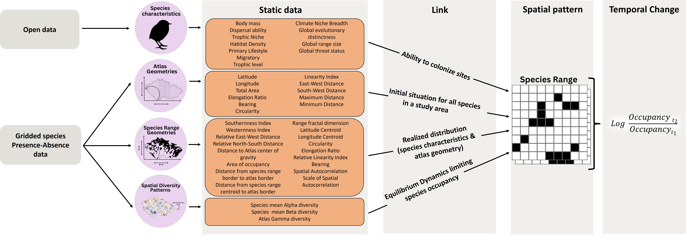

PhD activities
=====
In September 2023 I started my doctoral studies at the Czech University of Life Sciences in Prague in Petr Keil's Modeling of Biodiversity Lab working on universal patterns of temporal biodiversity change. During my first year, I worked on predicting temporal change from static patterns. There is a preprint out. 

