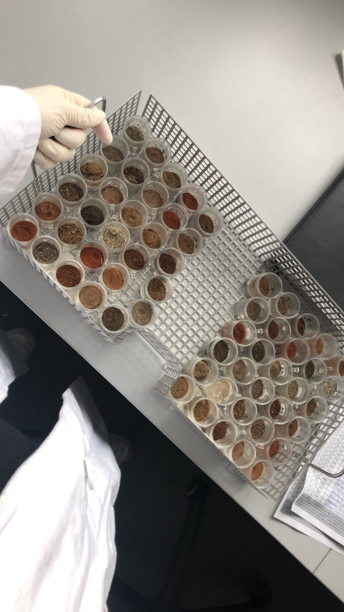
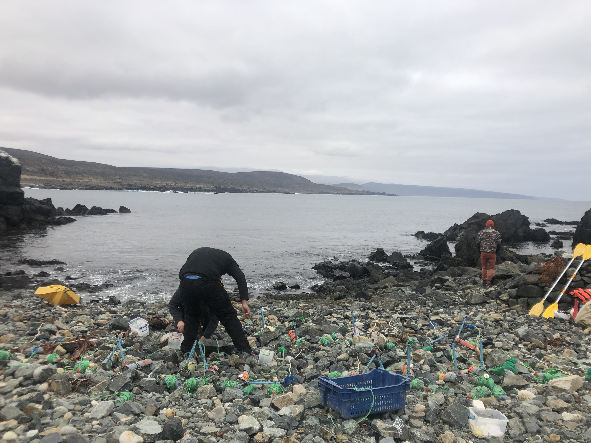
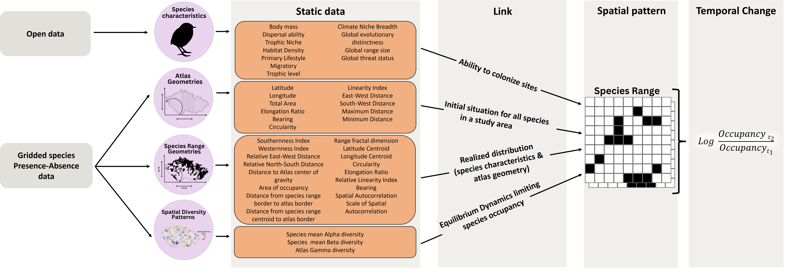
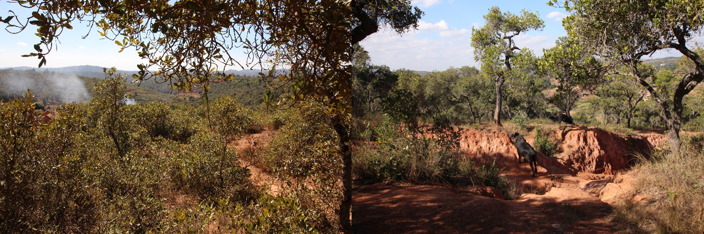
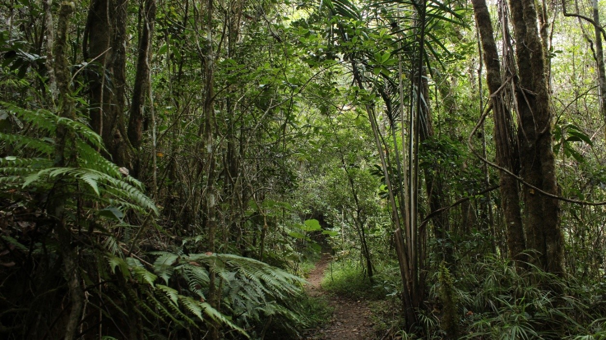
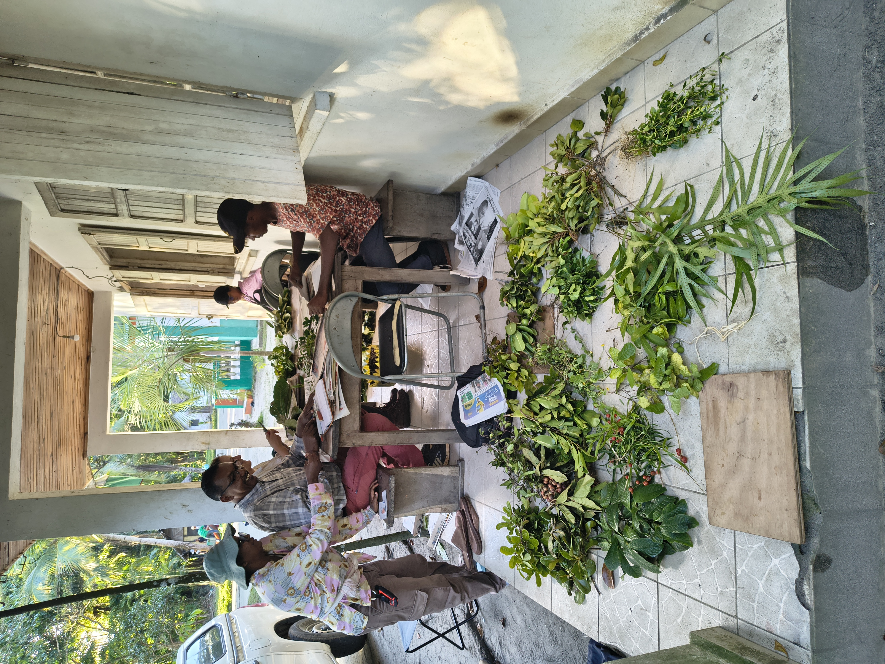
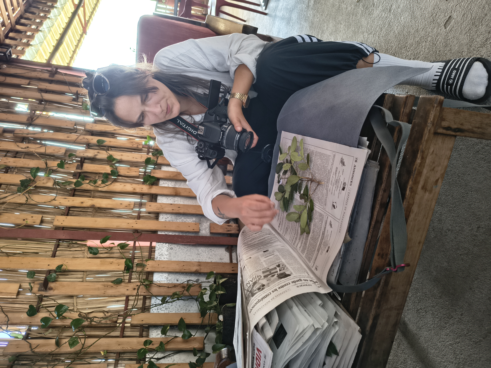
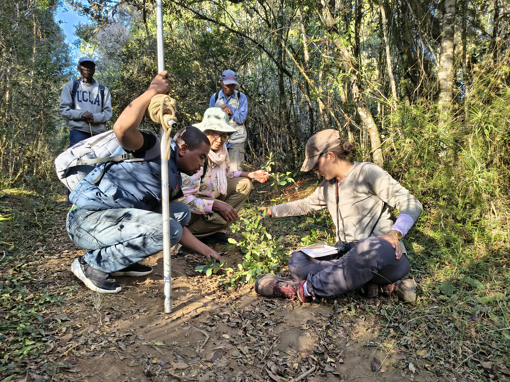
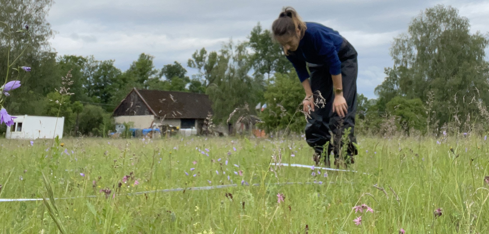

## Intro

> Hi! Welcome to my website mostly about my science life. I'm Friederike but everyone calls me Frieda. I'm a biologist currently living in Sweden where I'm doing a PhD on investigating the *Evolution of Biomes in Madagascar using Plant Phylogenetics* at Stockholm University.

I'm originally from Germany but I've always felt at home wherever I went. Whether it was Cape Town in South Africa where I lived for some time, or Chile where I did a research internship, or whether it was Prague or Stockholm. I enjoy discovering new places and living in different countries.. even more so if I can connect trips with research. I'm currently working on a project that will involve some time in Madagascar and I'm more than excited!

## Bachelor studies & activities

Following my high school graduation close to Bonn in Germany, I quickly moved to Leipzig, where I did my bachelor's and master's in Biology, and Biodiveristy, Ecology and Evolution respectively (2019, 2021). During my bachelor studies and student jobs (2016-2019), I mostly focussed on botany, genetics and plant biotechnological subjects, but through unplanned circumstances, I found my passion in exploring macroecological patterns in nature. In 2019 I finished my bachelor's thesis at [iDiv](https://www.idiv.de/research/core-research-groups/experimental-interaction-ecology/), where I explored the [secret drivers of soil microbes and their productivity across global drylands](https://friedarosa.github.io/publications/bachelor). The thesis was mostly focussed on laboratory work with soil samples, but also included spatial macroecological modelling.

## Microplastics internship

Right after I handed in my thesis, I headed to Coquimbo, Chile to do a DAAD-funded research intership on microplastics pollution in the South Pacific at [BEDIM at Universidad Católica del Norte](https://bedim.ucn.cl/) contributing with lab and field work to the following publication: [Sea-Surface Slicks and Their Effect on the Concentration of Plastics and Zooplankton in the Coastal Waters of Rapa Nui (Easter Island)](https://doi.org/10.3389/fmars.2021.688224)

During my time in Chile I fell in love with the Atacama desert and the Andes and had some time to travel around. I really miss the desert and different tones of red and orange of the mountains and landscapes and the differences between hot and cold desert regions in the Atacama. I was impressed by the plant diversity and traits of desert vegetation and all of the marine fossils that could be so easily found by having a stroll through the desert.

## Masters studies & activities

When I returned to Leipzig, I started a student job at iDiv in the [Eisenhauer Lab](https://www.idiv.de/research/core-research-groups/experimental-interaction-ecology/) to count and determine invertebrate samples from an [experimental insect decline project](https://www.idiv.de/research/projects/idiv-ecotron/experiments/) and do fieldwork on the [MyDiv BEF experimental site in Bad Lauchstädt](https://www.idiv.de/research/projects/mydiv/). When COVID hit, I had to refocus my work to computational studies and started my master's thesis with [Renske Onstein at iDiv](https://www.idiv.de/research/junior-research-groups/evolution-and-adaptation/) on the [macroecology & macroevolution of fruit size in plants](https://friedarosa.github.io/publications/masters) (see [New Phytologist paper from 2023](https://nph.onlinelibrary.wiley.com/doi/epdf/10.1111/nph.19061) or [State of the Worlds Plants & Fungi 2023 report](https://kew.iro.bl.uk/concern/reports/fccd9838-42a9-401f-a518-e76142164193), Chapter 4). I also had the pleasure to work with Rachel Souza Ferreira on the evolution of spinescence in Legumes - it was published in New Phytologist this year and you can find it [here](https://doi.org/10.1111/nph.71376).

## PhD activities

### Prague, Czech Republic (2023-2025)

In September 2023 I joined [Petr Keil's Modeling of Biodiversity Lab](https://petrkeil.github.io/) at the Czech University of Life Sciences in Prague, Czechia, for a PhD in Spatial Sciences. I worked on universal patterns of temporal biodiversity change in spatial data. There is a [preprint](https://doi.org/10.22541/au.172978475.51624422/v1) out that I did during my first year on predicting temporal change from a single snapshot of a species' distribution and geometric features of that range.

During the time in Prague, I collaborated with my colleagues for their projects (e.g., [Soria et al.](https://doi.org/10.1111/geb.70221), [Grattarola et al.](https://doi.org/10.64898/2026.09.24.754027), [Ortega-Solis et al.](https://doi.org/10.64898/2026.05.29.728651), spent numerous hours double-, triple- and quadruple-checking datasets that were harmonized by my colleagues, and finished all formal PhD requirements for four years within the first year.

### Stockholm, Sweden (2025 - ongoing)

In 2025, I changed location, subject, and PhD supervisor and am now enrolled in a PhD program at Stockholm University. I'm super glad I made the change and I can finally go back to working with and in nature again instead of being a boring 'desk biologist'.

For my PhD in Stockholm I joined [Jan Hackel's *Evolutionary plant biogeography* group](https://www.su.se/english/research/research-catalogue/research-groups/9/group-hackel) to investigate the Evolution of Biomes in Madagascar using Plant Phylogenetics. In 2026, I spent some weeks in the field in Madagascar, collecting samples from endemic plants to reconstruct the origin and evolution of biomes. I will use these samples to generate genetic data in the lab, infer phylogenies and use models to reconstruct their evolution through time. I'm looking very much forward to doing fieldwork in Madagascar and to spend some months locked in the lab before I have to go back to working on my desk.

{width="2250"}

## Other activities

During my PhD in Prague, I joined a [European Grassland project](https://www.adamclarktheecologist.com/research/grace) for which I spent a couple of weeks in the field, sampling grassland plots along the Czech-Austrian border in 2024.

Following my contract termination at CZU in Prague in July 2025, I started working on Rpackage development and writing unit tests with [Ondřej Mottl](https://ondrejmottl.github.io/) for [*RRatepol*](https://github.com/HOPE-UIB-BIO/R-Ratepol-package). A package for estimating rate of change (RoC) from paleoecological community data in time series (e.g., Fossils, Pollen). More infos [here](https://hope-uib-bio.github.io/R-Ratepol-package/).