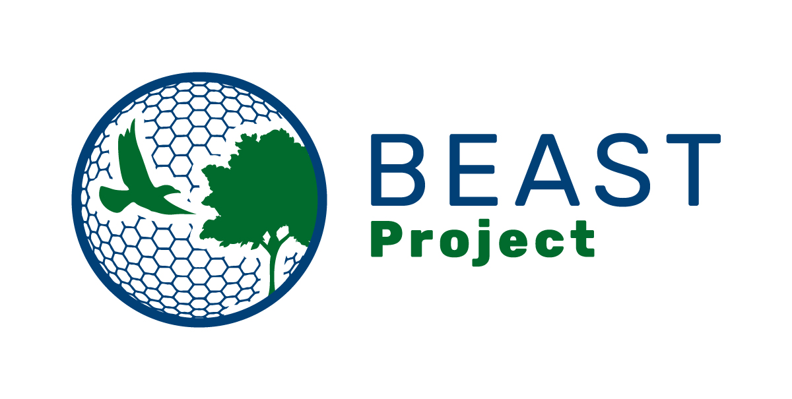

::: {#heading}
**BEAST** stands for 'Biodiversity dynamics across a continuum of space, time, and their scales'. The project PI is Petr Keil (FZP, Czech University of Life Sciences) and it's an ERC-funded consolidator project (2023-2027).

For more information, visit the [project website](https://petrkeil.github.io/funding/post/2023/01/01/BEAST.html). 

## Project Description

This ERC-funded consolidator project (2023-2027) will estimate how has biodiversity changed across continents and over the last decades. There are concerns that humanity has triggered the sixth mass extinction. However, some studies show that change at the local level is much more nuanced. In other words, species are disappearing from the planet, but it seems that not much has been happening on an average patch behind your house. Furthermore, we know very little about how these small and large-scale processes are connected, and where exactly on Earth are they happening. At the same time, estimates of biodiversity change are needed and explicitly required (see e.g. Aichi targets) for informed decisions and conservation policy. Despite this, we still lack reliable estimates of how fast, where, and in which environments biodiversity changes.

BEAST will assess these changes and the contrast between the local, regional, and global scale. We expect that the local changes in biodiversity that happen in our immediate surroundings are different from the changes that take place at the level of regions, states, and continents. This can be tested using large databases such as the American Breeding Bird Survey, eBird, and similar datasets based on citizen science.

## My Role

I started as a PhD student with Petr Keil in September 2023 at the Czech University of Life Sciences in Prague, Czechia. My PhD project was about using static imprints of biodiversity (mostly species distributions) to predict their trajectory of temporal change (i.e., becoming more fragmented and size reductions in distributions or the opposite). I used machine learning and properties used in physics to analyse phase transitions (percolation theory, fractals). I also used geometry to predict temporal change. There is a preprint from October 2024 here:

Friederike Wölke, Gabriel Ortega Solís, Carmen Soria, et al. Predicting temporal change of species distributions from a single snapshot. Authorea. 24 October 2024. DOI: https://doi.org/10.22541/au.172978475.51624422/v1
:::
