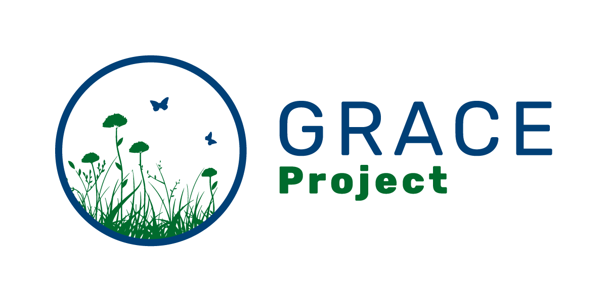

::: {#heading}
**GRACE** stands for 'GRAssland Communities Experiment (GRACE): 300 years of insight from a large-scale natural experiment'. This is a 3-year project (2024-2026). GRACE is a joint grant from the Austrian FWF and Czech GACR, with co-PIs Adam Clark (University of Graz) and Petr Keil (CZU, Prague), and cooperation partners Franz Essl at Uni. Vienna and Hana Skokanová at VUKOZ, Brno. Other external collaborators include Helge Bruelheide and Ute Jandt at Uni. Halle (Germany), Stefan Dullinger at Uni. Vienna, and Milan Chytrý at Masaryk University Brno, as well as the European Vegetation Archive (EVA) and its ReSurveyEurope initiatives.

The research focuses on tracking interactive dynamics of landscapes and grassland plant communities, based on the natural experiment arising from differences in landscape structure along the Austrian-Czech border region.

For more information, visit the [project website](https://petrkeil.github.io/funding/post/2023/02/02/GRACE.html). 

## My Role

I was involved in field work along the Czech-Austrian borders to survey grassland plots in 2024.
:::
